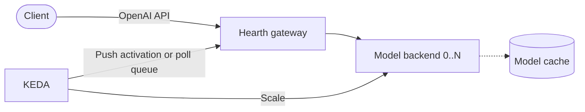

<div align="center">

# 🔥 Hearth

**A minimal, composable LLM serving control plane for private Kubernetes clusters.**

Declarative, scale-to-zero LLM serving for NVIDIA and Ascend runtimes.

[](LICENSE)
[](go.mod)
[](https://github.com/hearth-project/hearth/releases)
[](https://github.com/hearth-project/hearth/actions/workflows/test.yml)
[](ROADMAP.md)

[**Install**](#install) · [**Quickstart**](#quickstart) · [**Documentation**](docs/README.md) · [**Roadmap**](ROADMAP.md) · [**Contributing**](CONTRIBUTING.md)

</div>

Hearth turns a model and a runtime choice into a Kubernetes deployment with model caching,
queue-driven autoscaling, and scale-to-zero. `LLMService` is the workload API;
cluster administrators provide reusable `InferenceRuntime` profiles for the accelerators available
in their cluster.

> **Status — `v0.3.0` (alpha).** Hardware validation covers NVIDIA A100,
> two NVIDIA A10 GPUs (`0→1→2→0`), the two-device Atlas 300I Duo (`0→1→2→0`), and a
> single-device Ascend 910B3 (`0→1→0`). Results are specific to the recorded hardware and software
> stacks. Atlas 300I Pro remains rendering-tested only. The A100 result used vLLM `v0.22.0`; the
> upgraded `v0.25.1` profile requires focused A100 revalidation. The API is `v1alpha1`, and Hearth
> is not production-ready for shared or customer-facing workloads.

## Demo

[](docs/imgs/demo.mp4)

In this 50-second, hardware-neutral recording, Kthena keeps a hot model ready while a real request
activates a Hearth-managed long-tail model from zero and lets it return to zero afterward. See the
[operational demo](docs/demo.md) for the commands, scope, and hardware evidence.

## Why Hearth

- **Scale-to-zero is the center of gravity.** An always-on gateway holds or rejects cold requests
  while KEDA activates the model backend; idle models consume no accelerators.
- **One workload API, reusable runtime profiles.** Application owners describe the model and
  scaling intent. Cluster administrators define images, device resources, scheduling, and probes.
- **Thin vendor integration.** Most hardware differences are declarative runtime data; small
  NVIDIA and Ascend adapters translate the remaining Kubernetes-specific behavior.
- **Optional integrations stay optional.** KEDA is required for autoscaling and scale-to-zero, but
  basic reconciliation continues without it. Prometheus and Grafana are independent, opt-in
  integrations.

| Layer | Owner | Hearth's role |
|---|---|---|
| Inference engine | vLLM and vLLM-Ascend | Runs it; does not implement kernels or inference engines. |
| Accelerator discovery and scheduling | Vendor device plugins and optional Kubernetes schedulers | Consumes advertised resources and runtime scheduling configuration. |
| Fleet routing and datacenter-scale serving | Kthena, AIBrix, KServe, llm-d, and similar platforms | Stays outside this scope; Hearth can coexist as a smaller scale-to-zero control plane. |
| Model lifecycle and scale-to-zero | Hearth | Reconciles serving workloads, caching, gateways, and KEDA autoscaling. |

See [Architecture](docs/architecture.md) for the complete boundary and reconciliation model.

### Hearth and Kthena

[Kthena](https://github.com/volcano-sh/kthena), a [Volcano](https://volcano.sh/) sub-project, is a
Kubernetes-native AI serving **platform**: multi-model routing, KV-cache-aware scheduling,
prefill/decode disaggregation, and fleet-scale autoscaling, with first-class NPU support. If you run
a serious multi-model serving estate, **use Kthena — it's excellent.** Hearth lives at the other end
of the same axis: a handful of occasionally-used models on a handful of cards, where you want the
smallest possible footprint — one manifest, KEDA, done. The two compose naturally on one cluster:
**hot, high-traffic models on Kthena; the long tail scaled to zero with Hearth**, on the same
(Volcano-schedulable) silicon. This split has been exercised with real inference on two physical
accelerators; see the [operational demo](docs/demo.md) and
[validation report](docs/nvidia/a10-validation.md).

## Architecture

One `LLMService` consumes one cluster-scoped `InferenceRuntime` and reconciles to a backend
Deployment and Service, a gateway Deployment and Service, optional cache and prewarm resources,
and a KEDA `ScaledObject` when KEDA is installed.



The gateway exposes the demand signal, buffers requests during cold start, and forwards them once
the model is ready. KEDA polling is the compatibility default; an opt-in ExternalScaler removes the
poll interval from cold activation. See the [architecture guide](docs/architecture.md) for the full
data flow and gateway-replica constraint.

## Install

Hearth requires Kubernetes 1.29 or newer, `kubectl`, and Helm. Install KEDA when you need
autoscaling or scale-to-zero. Drivers and device plugins are hardware prerequisites and are not
installed by Hearth.

```bash
HEARTH_VERSION=0.3.0

helm repo add kedacore https://kedacore.github.io/charts --force-update
helm upgrade --install keda kedacore/keda \
  --version 2.20.1 \
  --namespace keda \
  --create-namespace

helm upgrade --install hearth \
  "https://github.com/hearth-project/hearth/releases/download/v${HEARTH_VERSION}/hearth-${HEARTH_VERSION}.tgz" \
  --namespace hearth-system \
  --create-namespace

kubectl rollout status deployment/hearth-controller-manager -n hearth-system
```

This installs the CRDs, RBAC, operator, and the version-matched operator and gateway image
configuration. See [Getting started](docs/started.md) for source-checkout installation,
upgrade considerations, and cleanup.

## Quickstart

Choose exactly one profile matching the installed accelerator device plugin. This A10 example
expects the exact `nvidia.com/gpu.product=NVIDIA-A10` node label, a default dynamic StorageClass
with at least 30 GiB available, and access to ModelScope. From a source checkout:

```bash
kubectl create namespace ai --dry-run=client -o yaml | kubectl apply -f -
kubectl apply -n ai -k examples/nvidia/a10

kubectl get inferenceruntime vllm-nvidia-a10
kubectl get llmservice,deployment,pod,service,pvc,job,scaledobject -n ai -w
```

The profile installs a cluster-scoped runtime and a namespaced `LLMService`. Its prewarm Job first
downloads the model; the first request then activates the backend from zero. Follow the
[LLMService walkthrough](docs/started.md#understand-the-llmservice) to call the endpoint and
observe the lifecycle.

For other devices, select a profile from [`examples/`](examples). To exercise the full loop without
an accelerator, use the [no-GPU development guide](docs/no-gpu.md).

## Documentation

- [Getting started](docs/started.md) — installation, profile selection, inference, upgrades,
  and cleanup.
- [Architecture](docs/architecture.md) — component boundaries and the scale-to-zero data flow.
- [Hearth and Kthena demo](docs/demo.md) — a command-driven hot-model and long-tail
  model serving walkthrough.
- [CRD reference](docs/crd-reference.md) — `LLMService` and `InferenceRuntime` fields.
- [Hardware profiles](examples/README.md) — available devices and their validation level.
- [Ascend validation](docs/ascend/ascend-validation.md) — exact stacks, evidence, and product-specific
  runbooks.
- [NVIDIA A10 validation](docs/nvidia/a10-validation.md) — two-device lifecycle evidence and the
  reproducible K3s runbook.
- [Observability](docs/observability.md) — optional Prometheus and Grafana integration.
- [Roadmap](ROADMAP.md) — current limitations and the path to production readiness.

## Contributing

Contributions, bug reports, and hardware-validation results are welcome. Start with
[CONTRIBUTING.md](CONTRIBUTING.md), follow the [Code of Conduct](CODE_OF_CONDUCT.md), and report
security issues through [SECURITY.md](SECURITY.md).

## License

Licensed under the [Apache License 2.0](LICENSE).
