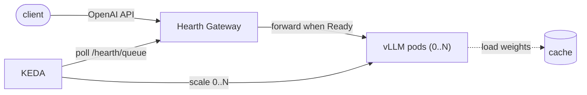

<div align="center">

# 🔥 Hearth

**A minimal, composable LLM serving control plane for private Kubernetes clusters.**

Declarative, vendor-neutral, scale-to-zero serving across NVIDIA, Ascend, and more.

[](LICENSE)
[](go.mod)
[](https://github.com/hearth-project/hearth/releases)
[](https://github.com/hearth-project/hearth/actions/workflows/test.yml)
[](ROADMAP.md)

[**Quickstart**](#quickstart) · [**Architecture**](docs/architecture.md) · [**Observability**](docs/observability.md) · [**Roadmap**](ROADMAP.md) · [**Contributing**](CONTRIBUTING.md)

</div>

Hearth turns "run Qwen / DeepSeek / GLM on my private cluster" into a single `LLMService`
manifest: declarative deployment, queue-driven autoscaling, and **scale-to-zero**, with
NVIDIA-vLLM, vLLM-Ascend, and future runtimes as **pluggable backends** behind one API.

> **Status — `v0.2.0-rc.1` (alpha).** The NVIDIA backend and the full scale-to-zero path
> (gateway + KEDA) are **implemented and verified end-to-end on real NVIDIA GPUs** — cold-start
> keepalive, graceful drain, model caching/prewarm, 1→N autoscaling, and observability. The
> **Ascend 910B** backend is now an **experimental / technical preview**: on a real 910B we've
> verified vLLM-Ascend serves on the NPU, the operator renders correct 910B manifests, and the
> gateway data-plane works — but the operator scheduling a pod onto an NPU via the device plugin
> (full integrated scale-to-zero e2e) is **not yet verified** (needs a schedulable NPU node). See the
> [Ascend 910B validation report](docs/ascend-910b-validation.md). Still `v1alpha1` and **not
> production-ready** (no auth, no multi-tenancy) — see the **[roadmap](ROADMAP.md)**. ⭐ and follow along.

## Why Hearth

The "LLM on K8s" space has excellent **platforms**: [KServe](https://kserve.github.io/website/) +
[llm-d](https://llm-d.ai/) at datacenter scale, [AIBrix](https://github.com/vllm-project/aibrix) as
vLLM's control plane, and [Kthena](https://github.com/volcano-sh/kthena) for fleet-grade serving.
Hearth focuses on the smaller end: serving a few open-source LLMs well on a few accelerators while
composing with the Kubernetes infrastructure already in the cluster.

- **One user-facing CRD + KEDA.** No router fleet, no webhook suite, no new autoscaler to learn —
  if KEDA runs on your cluster, you're most of the way there. Degrades gracefully when
  KEDA/Prometheus are absent.
- **Scale-to-zero is the center of gravity.** Idle models hold **zero** accelerators; a small
  gateway buffers the cold-start request and KEDA wakes the backend.
- **Vendor-neutral, domestic-silicon-friendly.** The same manifest runs on NVIDIA or Ascend;
  backends are *data*, not code. Private/"XinChuang" delivery is a first-class concern.
- **Small enough to audit** in an afternoon (~5K lines of Go), light enough for edge boxes and
  air-gapped clusters.

**What Hearth does — and deliberately does not do:**

| Layer | Owner | Hearth |
|---|---|---|
| Inference engine | vLLM (+ `vllm-ascend` / `vllm-mlu`) | **Uses it.** Never re-implements; writes no chip kernels. |
| GPU/NPU scheduling | device plugins, **HAMi**, **Volcano** | **Builds on.** Targets their resources; never replaces them. |
| Fleet routing, P/D disaggregation, and datacenter scale-out | **Kthena**, **AIBrix**, **KServe**/**llm-d** | **Composes with them.** Hearth remains the lightweight control plane for smaller deployments. |
| Declarative lifecycle + scale-to-zero + vendor-neutral packaging, at the small end | — | **This is Hearth.** |

### Hearth and Kthena

[Kthena](https://github.com/volcano-sh/kthena), a [Volcano](https://volcano.sh/) sub-project, is a
Kubernetes-native AI serving **platform**: multi-model routing, KV-cache-aware scheduling,
prefill/decode disaggregation, and fleet-scale autoscaling, with first-class NPU support. If you run
a serious multi-model serving estate, **use Kthena — it's excellent.** Hearth lives at the other end
of the same axis: a handful of occasionally-used models on a handful of cards, where you want the
smallest possible footprint — one manifest, KEDA, done. The two compose naturally on one cluster:
**hot, high-traffic models on Kthena; the long tail scaled to zero with Hearth**, on the same
(Volcano-schedulable) silicon. We also share operational lessons from Hearth's verified
scale-to-zero path with Kthena's scale-to-zero design
([kthena#1019](https://github.com/volcano-sh/kthena/issues/1019)).

## Architecture

`LLMService` (what to serve + how to scale) + `InferenceRuntime` (a pluggable backend) → the operator
renders a vLLM `Deployment` + `Service`, a model cache, and a KEDA `ScaledObject` that scales on the
pending-request count of a small Hearth gateway, which buffers requests during cold start.



📖 See [`docs/architecture.md`](docs/architecture.md) for components, CRDs, and the full
scale-to-zero data flow — and [`docs/observability.md`](docs/observability.md) for the dashboard.

## A 60-second example

```yaml
apiVersion: serving.hearth.dev/v1alpha1
kind: LLMService
metadata:
  name: qwen3-8b
  namespace: ai
spec:
  model:
    source:
      uri: modelscope://Qwen/Qwen3-8B-Instruct   # hf:// | modelscope:// | pvc://
  runtime:
    selector: { vendor: [nvidia, ascend] }        # auto-pick a backend, in preference order
  resources:
    accelerators: 1
  scaling:
    min: 0            # scale-to-zero
    max: 3
    metric: queueDepth
    target: 10
```

```console
$ kubectl apply -f qwen3-8b.yaml
$ kubectl get llmservice -n ai
NAME       PHASE          RUNTIME       REPLICAS   AGE
qwen3-8b   ScaledToZero   vllm-nvidia   0          30s
```

The same manifest runs on an Ascend cluster by making `vllm-ascend` the available runtime — no spec
change. **That portability is the whole point.**

## Multi-backend, by design

Backends are described declaratively in a cluster-scoped `InferenceRuntime` (image, args, accelerator
resource, probes, metrics). Adapter **code** is thin because the differences are data:

| Backend | Engine | Accelerator | v0 status |
|---|---|---|---|
| `vllm-nvidia` | NVIDIA-vLLM | `nvidia.com/gpu` | ✅ implemented + verified on GPU |
| `vllm-ascend` | vLLM-Ascend | `huawei.com/Ascend910` | 🧪 experimental preview — serves on real 910B; render + gateway verified; full scheduling e2e pending ([report](docs/ascend-910b-validation.md)) |
| `vllm-ascend-310p-*` | vLLM-Ascend | `huawei.com/Ascend310P` | ✅ Atlas 300I Duo scale-to-zero verified on two physical 310P3 devices; Atlas 300I Pro remains rendering-tested ([report and runbook](docs/ascend-310p-validation.md)) |
| `vllm-mlu` (Cambricon) | vLLM-MLU | `cambricon.com/mlu` | 🗺️ planned |

Adding a chip is a small adapter, not a rewrite — see [`internal/backend`](internal/backend).

## Quickstart

> Try the control plane on **kind — no GPU required**.

```bash
# 1. install the CRDs into your current kube-context
make install

# 2. run the operator against that context
make run

# 3. register a backend + a service
kubectl create namespace ai
kubectl apply -f config/samples/serving_v1alpha1_inferenceruntime.yaml
kubectl apply -f config/samples/serving_v1alpha1_llmservice.yaml -n ai

# 4. watch it reconcile (backend pod stays Pending without a GPU — expected)
kubectl get llmservice,deploy,svc -n ai
```

This exercises the control plane: the operator reconciles an `LLMService` into its child objects. The
gateway and backend pods start once you point the operator at a built gateway image
(`go run ./cmd/main.go --gateway-image=<your-registry>/hearth-gateway:<version>`) and provide an accelerator node
with the device plugin. A spot-GPU walkthrough is coming to [`docs/`](docs).

## Install

> **Alpha.** Each release publishes the operator + gateway images and the chart to
> `ghcr.io/hearth-project`, so install is one command — no building required. Still alpha and **not
> production-ready** (no auth, no multi-tenancy); see the [roadmap](ROADMAP.md).

Hearth needs **KEDA** for scale-to-zero (and optionally the **Prometheus Operator** for the
ServiceMonitor + dashboard — Hearth degrades gracefully without it).

```bash
# 1. KEDA (required for autoscaling / scale-to-zero)
helm repo add kedacore https://kedacore.github.io/charts
helm install keda kedacore/keda -n keda --create-namespace

# 2. Hearth (CRDs + RBAC + operator). The chart defaults to the published
#    ghcr.io/hearth-project images at this version — no --set needed.
helm install hearth ./charts/hearth -n hearth-system --create-namespace

# 3. register a backend and deploy a model
kubectl apply -f config/samples/serving_v1alpha1_inferenceruntime.yaml
kubectl apply -f config/samples/serving_v1alpha1_llmservice.yaml
kubectl get llmservice -w
```

> **Upgrading from a `kubectl apply` CRD install?** Helm v4 applies CRDs via Server-Side Apply and
> conflicts with CRDs previously installed by `kubectl apply` (e.g. `make install`). Either delete
> them first — `kubectl delete crd inferenceruntimes.serving.hearth.dev llmservices.serving.hearth.dev`
> — or install CRDs with `kubectl apply --server-side` so both tools share a field manager.

## Roadmap

See **[ROADMAP.md](ROADMAP.md)** for the prioritized path to production and what v0 is (and isn't) good for.

- **v0 — `v0.1.0` (released)** — multi-backend abstraction on NVIDIA, **verified end-to-end on
  real GPUs**: model caching/prewarm, gateway + KEDA scale-to-zero, cold-start keepalive, graceful
  drain, 1→N autoscaling, Helm + dashboard.
- **`v0.2.0-rc.1` (pre-release)** — **Ascend 910B experimental preview**: vLLM-Ascend serving verified
  on real 910B silicon, operator manifests confirmed correct, gateway data-plane verified on the NPU
  ([report](docs/ascend-910b-validation.md)). Device-plugin scheduling e2e still pending.
- **v1** — complete the remaining Ascend 910B and Atlas 300I Pro hardware loops, then Moore Threads;
  Volcano/HAMi live validation, `oci://` sources, and shared caching for private delivery. Atlas
  300I Duo is already scale-to-zero verified.
- **v2** — Cambricon/Hygon; LoRA; air-gapped "XinChuang" offline bundle.

> **Not production-ready yet** — no auth, no multi-tenancy, `v1alpha1` API. It's a strong fit today
> for **internal/dev, latency-tolerant, cost-sensitive** serving (scale-to-zero packs many idle models
> onto few GPUs). See the roadmap's production-readiness section before exposing it to real users.

## Contributing

Hearth is early and moving fast — contributions, issues, and ideas are very welcome, especially
**validating the remaining Ascend profiles on real NPUs** and the [roadmap](ROADMAP.md)'s "Now"/P1 items. Start with
**[CONTRIBUTING.md](CONTRIBUTING.md)** and please follow our [Code of Conduct](CODE_OF_CONDUCT.md).
To report a vulnerability, see [SECURITY.md](SECURITY.md).

## License

Licensed under [**Apache-2.0**](LICENSE).
