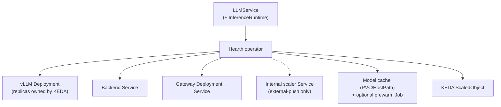
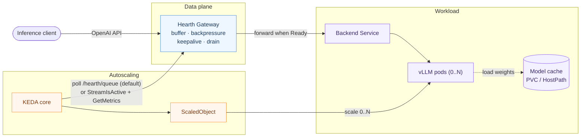

# Architecture

Hearth is a minimal, composable LLM serving control plane for private Kubernetes clusters. A single
`LLMService` manifest produces a declarative, queue-driven, **scale-to-zero** model server across
NVIDIA, Ascend, and other accelerators.

## Boundary (what Hearth is, and isn't)

Hearth owns the **Kubernetes orchestration / lifecycle layer**: rendering workloads, model loading,
health, scheduling adaptation, scale-to-zero, and stable metrics surfaces. It deliberately does
**not** re-implement the inference engine (that's **vLLM** + vendor plugins) or write chip kernels /
device plugins / schedulers (that's the vendors, **HAMi**, **Volcano**). Fleet routing,
prefill/decode disaggregation,
and datacenter scale-out belong to **Kthena**, **AIBrix**, and **KServe**/**llm-d**; Hearth composes
with them as the lightweight, scale-to-zero end of that axis (see
["Hearth and Kthena"](https://hearth-project.dev/#hearth-and-kthena)). A new accelerator is a thin
adapter, not a rewrite.

## CRDs

API group `serving.hearth.dev/v1alpha1`.

- **`LLMService`** (namespaced, user-facing) — *what* to serve and *how* to scale: the model source,
  a runtime selection (pin a backend or auto-pick by vendor), abstract resources, scaling intent
  (incl. `min: 0` for scale-to-zero), cache strategy, and cold-start behavior.
- **`InferenceRuntime`** (cluster-scoped, reusable) — a *pluggable backend driver*: container image +
  templated args, the device-plugin resource name (e.g. `nvidia.com/gpu`, `huawei.com/Ascend910`),
  scheduling (nodeSelector/tolerations/scheduler), model-load-aware probes, lifecycle (drain), and
  optional runtime metric metadata. This is the multi-backend differentiator.

## Components

- **Operator / controllers** (`internal/controller`) — reconcile an `LLMService` (+ its
  `InferenceRuntime`) into the child objects below via server-side apply, gracefully skipping the
  optional KEDA CRD when absent.
- **Backend abstraction** (`internal/backend`) — a `BackendAdapter` interface + registry. Shared code
  renders the vLLM pod and accelerator request; thin NVIDIA and Ascend adapters add vendor
  specifics. Adapters are rendering-tested without claiming hardware validation.
- **Gateway** (`internal/gateway`) — the data plane: an OpenAI-compatible reverse proxy in front of
  each `LLMService`. It buffers requests during cold start, applies bounded-queue backpressure,
  emits SSE keepalive heartbeats (or fast-rejects), drains in-flight streams on scale-down, and
  exposes its pending-request count over HTTP and, when enabled, KEDA's ExternalScaler gRPC API.

## Reconcile output

For one `LLMService`, the operator renders: a vLLM **Deployment** (it does *not* set `replicas` —
KEDA owns `0..N`), a backend **Service**, a **gateway** Deployment + Service, a model **cache**
(PVC/HostPath) + optional **prewarm Job**, and a KEDA **ScaledObject**. External-push mode also
creates a cluster-internal scaler Service for the gateway's gRPC port.

## Scale-to-zero data flow

1. **Idle** — KEDA holds the backend Deployment at **0**.
2. **Cold request** — the gateway admits the request (bounded queue → `429` if full), raises its
   `pending` count, and holds the connection. In `keepalive` mode it streams SSE heartbeats so the
   client/ingress don't time out; in `reject` mode it returns `503 + Retry-After` and the client retries.
3. **Activation** — in the default `metrics-api` mode, KEDA polls `/hearth/queue`. In opt-in
   `external-push` mode, the co-located ExternalScaler sends an active event immediately and KEDA
   continues to call `GetMetrics` for the queue value. Either path drives the Deployment **0 → 1**.
   The pod loads weights from cache and becomes **Ready** only after the model is loaded.
4. **Serve** — the gateway forwards the buffered request and streams tokens back.
5. **Scale up** — sustained queue depth above the per-replica target scales **1 → N** (one whole
   device per replica).
6. **Scale down** — when demand drops, KEDA scales back toward **0**; a `preStop` drain lets
   in-flight streams finish before the pod is terminated.

### Scaler transport

`metrics-api` remains the compatibility default. Set the operator's
`--scaler-mode=external-push` flag, or Helm value `gateway.scalerMode=external-push`, to remove the
poll interval from cold activation. External-push requires exactly one gateway replica: a KEDA
stream connects to one Pod and Hearth does not yet aggregate demand across gateway replicas. The
operator refuses that mode when `gateway.replicas` is not `1`.

Cold admission starts an activation lease that is independent of the client connection. The lease
keeps demand active until the backend becomes ready (plus a short retry grace) or
`activationTimeout` expires. This lets `reject` mode return `503 + Retry-After` without losing the
activation signal. Every new gRPC stream receives the current state immediately, including when
KEDA reconnects the stream. `/hearth/queue` remains available for observability and rollback.

The scaler Service is ClusterIP-only and uses plaintext gRPC on port `9090`; it is not exposed by
the public gateway Service. Restrict access with cluster NetworkPolicy where tenant isolation is
required.

## Observability

vLLM and the gateway expose `/metrics` through Services with a stable `http` port and
`serving.hearth.dev/llmservice` discovery label. Hearth does not install or manage
`kube-prometheus-stack` or other monitoring resources. The independent
[`examples/observability`](https://github.com/hearth-project/hearth/tree/main/examples/observability)
package provides an opt-in `ServiceMonitor` and Grafana dashboard.

## Caching

Cold-start cost is dominated by fetching + loading weights, so caching is what makes scale-to-zero
usable. Hearth supports `HostPath` and `NodeLocalPVC` (with a pinnable `storageClassName`), plus a
prewarm Job for Hugging Face or ModelScope weights. A `pvc://` source mounts pre-staged weights
read-only and skips prewarming. Node-local caches are per-node today;
`SharedPVC` (RWX) for multi-node is on the roadmap.
Prewarm Pods inherit the runtime's node selector, tolerations, and scheduler but do not consume an
accelerator.
Cache PVCs and prewarm Jobs are create-once resources because their workload fields are immutable;
changing the model or cache configuration requires explicitly replacing the affected resource.
